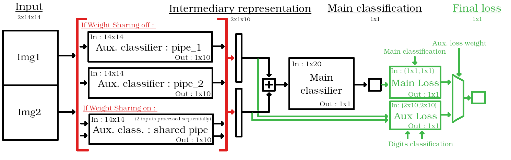
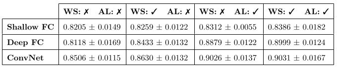

This README is a short overview, for more details, see report.txt.

Authors: Quentin Bouvet, Tobia Albergoni, Matteo Feo

## Introduction

#### Goal

This projects evaluates the effect of _auxiliary loss_ and  _weight sharing_ techniques for neural networks. These techniques are tested on various neural network architectures: shallow fully-connected, deep fully-connected and convolutional; on a classification/comparison task using the MNIST dataset. This project was carried out as part of a deep learning class.

  

  Architecture overview.    
  In red, Weight Sharing on/off. In green, Auxiliary loss.

#### Task

Our neural networks carry out a classification task. They receive as input a pair of images (-> 14x14x2 px) that represent hand-written digits. They produce as output the index of the image containing the biggest digit. As dataset, we use the MNIST Handwritten Digits Database.

#### Auxiliary loss (AL)

Auxiliary loss consists in adding an intermediary task into the network, producing a loss with a separate auxiliary loss function, and using a weighted average of the main task loss and the auxiliary loss for the backpropagation. Intuitively, this forces a part of the network to learn an intermediary task that we know to be meaningful in regards to achieving the main task.

Our intermediary task is the correct classification of images into digits classes. For our main loss, we use cross-entropy over 2x1 classes, for our auxiliary loss, we use cross-entropy over 10x1 classe. 

#### Weight sharing (WS)

For each (14x14x2) datapoint, our intermediary task is carried out twice (on 14x14x1 sub-datapoints). Weight sharing consists in re-using the same part of the network (i.e. the same weights) for both sub-datapoint as opposed to having two parts processing independantly one sub-datapoint. 

With weight sharing, the re-used part effectively sees twice as much data as without it, which should help with overfitting.

## Testing methodology

We arbitrarily pick the following architecures for testing :   
- a shallow fully-connected network  
- a deep fully-connected network  
- a more interesting convolutional / maxpool network inspired from staples ConvNets  

The expressiveness is not controlled for, but it doesn't matter since we don't compare architectures to one another. We're only interested in the effects of WS / AL on each individual architecture.

Tests are run 10 times on each architecture/techniques combination, so that we can report standard deviation. We report testing accuracy.

## Results

The use of WS and AL yielded improvements on all architectures. AL consistently gave bigger improvements than WS for this task, and combining the two techniques never resulted in a performance regression, although the improvements were sometimes models. 

  

  Our results

WS yielded delivered its smallest  improvements on our shallow fully-connected networks. This architecture is the least complex, with least opportunities for overfitting. Parallelly, WS yielded its biggest improvement on our deep fully-connected network, which is the most complex of the three. This is coherent with our hypothese that WS has an effect on overfitting